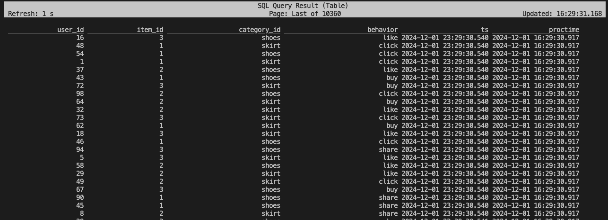
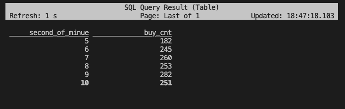
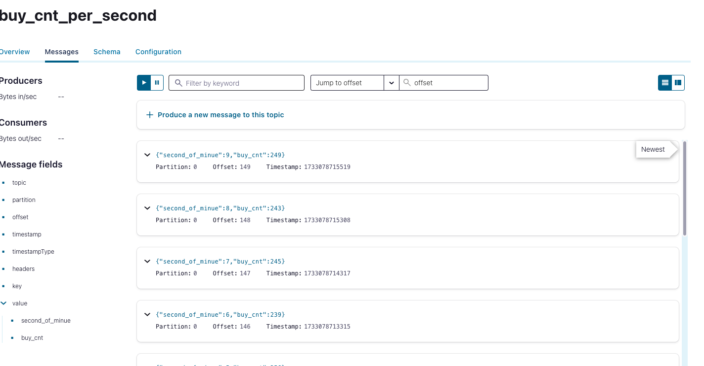
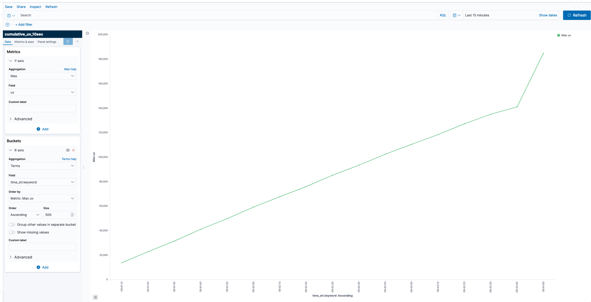

# Download jars dependence
In `pom.xml`, add dependencies for Elasticsearch and Kafka. For example, you can refer to the following file:
    - [elastic_pom.xml](../jars/elastic_pom.xml)
    - [kafka_pom.xml](../jars/kafka_pom.xml)
    - [jdbc_pom.xml](../jars/jdbc_pom.xml)
To install jars to local folder `jars`, run the following command:
```sh
mvn dependency:copy-dependencies -DoutputDirectory=./elastic -f elastic_pom.xml
mvn dependency:copy-dependencies -DoutputDirectory=./kafka -f kafka_pom.xml
mvn dependency:copy-dependencies -DoutputDirectory=./jdbc -f jdbc_pom.xml
```
## Run sql in local mode (Option 1)
In docker container, run the following command:
```sh
docker-compose exec flink-sql-client /bin/bash

./sql-client.sh \
    -l /mnt/jars/elastic \
    -l /mnt/jars/kafka \
    -l /mnt/jars/jdbc

export HADOOP_CLASSPATH=`hadoop classpath`
```
## Run sql in hadoop (Option 2)
In docker container, run the following command:

```sh
export HADOOP_CLASSPATH=`hadoop classpath`

cd ${HOME}/flink-1.16.0

./bin/sql-client.sh \
    -j ${HOME}/.m2/repository/org/apache/flink/flink-connector-kafka/1.16.0/flink-connector-kafka-1.16.0.jar \
    -j ${HOME}/.m2/repository/org/apache/kafka/kafka-clients/3.2.3/kafka-clients-3.2.3.jar \
    -l ${HOME}/jars/elasticsearch \
    -l ${HOME}/jars/jdbc

```


# Create table
```sh
SHOW TABLES;
```
## watermark
```sql
DROP TABLE IF EXISTS user_behavior;

CREATE TABLE user_behavior (
    user_id BIGINT,
    item_id BIGINT,
    category_id STRING,
    behavior STRING,
    ts TIMESTAMP(3),
    proctime AS PROCTIME(),   -- generates processing-time attribute using computed column
    WATERMARK FOR ts AS ts - INTERVAL '5' SECOND  -- defines watermark on ts column, marks ts as event-time attribute

) WITH (
    'connector' = 'kafka',  -- using kafka connector
    'topic' = 'user_behavior',  -- kafka topic
    'scan.startup.mode' = 'latest-offset',  -- reading from the beginning
    'properties.bootstrap.servers' = '10.237.96.122:9092',  -- kafka broker address
    'format' = 'json'  -- the data format is json
);
```

```sql
SELECT * FROM user_behavior;
```
Then the output will be:



Explain tolerate 1-seconds out-of-order, ts field becomes an event-time attribute

# Sql
## Aggregate
```sql

SELECT 
    user_id, 
    COUNT(*) AS behavior_count
FROM 
    user_behavior
GROUP BY 
    user_id;

EXPLAIN PLAN FOR SELECT role_id, count(*) from user_behavior group by role_id;
EXPLAIN CHANGELOG_MODE FOR SELECT role_id, count(*) from user_behavior group by role_id;
```

then, create table for kafka with topic `buy_cnt_per_second`

```sql
-- DROP TABLE IF EXISTS buy_cnt_per_second;

CREATE TABLE buy_cnt_per_second (
    -- hour BIGINT,
    second_of_minue BIGINT,
    buy_cnt BIGINT
) WITH (
    'connector' = 'kafka',  -- using kafka connector
    'topic' = 'buy_cnt_per_second',  -- kafka topic
    'scan.startup.mode' = 'latest-offset',  -- reading from the beginning
    'properties.bootstrap.servers' = '10.237.96.122:9092',  -- kafka broker address
    'format' = 'json'  -- the data format is json
);

INSERT INTO buy_cnt_per_second
SELECT SECOND(TUMBLE_START(ts, INTERVAL '1' SECOND)), COUNT(*)
FROM user_behavior
WHERE behavior = 'buy'
GROUP BY TUMBLE(ts, INTERVAL '1' SECOND);

SELECT * FROM buy_cnt_per_second;
```

Query the data in kafka



Or in Kafka Control Center




For elastic search, refer to [buy_cnt_per_second.sql](buy_cnt_per_second.sql)

### Group by item
```sql
DROP TABLE IF EXISTS buy_cnt_per_item;

CREATE TABLE buy_cnt_per_item (
    item BIGINT,
    buy_cnt BIGINT
) WITH (
    'connector' = 'kafka',  -- using kafka connector
    'topic' = 'buy_cnt_per_item',  -- kafka topic
    'scan.startup.mode' = 'latest-offset',  -- reading from the beginning
    'properties.bootstrap.servers' = '10.237.96.122:9092',  -- kafka broker address
    'format' = 'json'  -- the data format is json
    -- 'connector' = 'elasticsearch-7', -- using elasticsearch connector
    -- 'hosts' = 'http://elasticsearch:9200',  -- elasticsearch address
    -- 'index' = 'buy_cnt_per_hour'  -- elasticsearch index name, similar to database table name
);

```
# Reference

document of function sql be found in [systemfunctions](https://nightlies.apache.org/flink/flink-docs-release-1.16/docs/dev/table/functions/systemfunctions/)


# get cumulative uv

each 10 seconds, get the cumulative uv
```sh
curl -X DELETE "http://10.237.96.122:9200/cumulative_uv_10sec"
```

```sql
DROP TABLE IF EXISTS cumulative_uv_10sec;

CREATE TABLE cumulative_uv_10sec (
    date_str STRING,
    time_str STRING,
    uv BIGINT
    -- PRIMARY KEY (date_str, time_str) NOT ENFORCED
) WITH (
    'connector' = 'elasticsearch-7', -- using elasticsearch connector
    'hosts' = '10.237.96.122:9200',  -- elasticsearch address
    'index' = 'cumulative_uv_10sec'
);


INSERT INTO cumulative_uv_10sec
SELECT date_str, MAX(time_str), COUNT(DISTINCT user_id) as uv
FROM (
  SELECT
    DATE_FORMAT(ts, 'yyyy-MM-dd') as date_str,
    CONCAT(SUBSTR(DATE_FORMAT(ts, 'HH:mm:ss'), 1, 7), '0') as time_str,
    user_id
  FROM user_behavior
)
GROUP BY date_str;

```

output in Kibana


# Get total unique user

```sh
curl -X DELETE "http://10.237.96.122:9200/total_uv_10sec"
```

```sql
DROP TABLE IF EXISTS total_uv_10sec;

CREATE TABLE total_uv_10sec (
    date_str STRING,
    time_str STRING,
    uv BIGINT,
    PRIMARY KEY (date_str, time_str) NOT ENFORCED
) WITH (
    'connector' = 'elasticsearch-7', -- using elasticsearch connector
    'hosts' = '10.237.96.122:9200',  -- elasticsearch address
    'index' = 'total_uv_10sec'
);


INSERT INTO total_uv_10sec
SELECT date_str, MAX(time_str), COUNT(DISTINCT user_id) as uv
FROM (
  SELECT
    DATE_FORMAT(ts, 'yyyy-MM-dd') as date_str,
    CONCAT(SUBSTR(DATE_FORMAT(ts, 'HH:mm:ss'), 1, 7), '0') as time_str,
    user_id
  FROM user_behavior
)
GROUP BY date_str;
```

output in Kibana


# Top category
refer to [top_category.sql](top_category.sql)