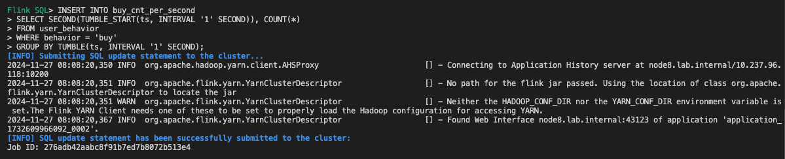
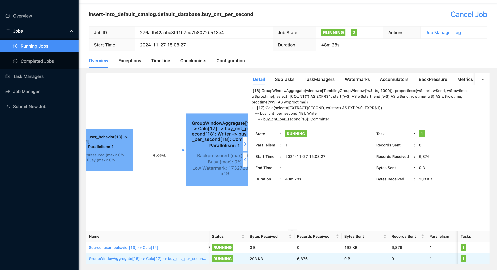

# setup config
```sh
rsync -avz ../config demo@10.237.96.122:/home/demo/flink/ 
rsync -avz hadoop-3.3.6/share/hadoop/mapreduce/hadoop-mapreduce-examples-3.3.6.jar lab@10.237.96.10:/home/lab/jars/
rsync -avz ../kafka/target/classes/kafka/wc.jar lab@10.237.96.10:/home/lab/jars/

```

# run container
```sh
docker run -it --rm \
    -v ${PWD}/config/yarn:/etc/hadoop/conf \
    --user root \
    --name yarn \
    apache/hadoop:3.4.0 \
    -d \
    /bin/bash -c "tail -f /dev/null"
```

# validate


```sh
apt-get update && apt-get install -y --no-install-recommends \
software-properties-common fontconfig java-common curl gnupg \
ca-certificates krb5-user libpam-krb5 freeipa-client build-essential \
&& apt-get autoremove -yqq --purge \
&& apt-get clean

set -eux \
    && curl -fL https://apt.corretto.aws/corretto.key | apt-key add - \
    && add-apt-repository 'deb http://apt.corretto.aws stable main' \
    && mkdir -p /usr/share/man/man1 || true \
    && apt-get update \
    && apt-get install -y java-1.8.0-amazon-corretto-jdk=1:8.265.01-1 \
    && apt-get purge -y --auto-remove -o APT::AutoRemove::RecommendsImportant=false \
    software-properties-common \
    && apt-get clean \
    && rm -rf /var/lib/apt/lists/*

# ENV LANG C.UTF-8
export JAVA_HOME=/usr/lib/jvm/java-1.8.0-amazon-corretto    
# Install Apache Hadoop
export HADOOP_VERSION=3.3.6
export HADOOP_HOME=/opt/hadoop
export HADOOP_CONF_DIR=/etc/hadoop
export MULTIHOMED_NETWORK=1

export HADOOP_URL="https://dlcdn.apache.org/hadoop/common/hadoop-$HADOOP_VERSION/hadoop-$HADOOP_VERSION.tar.gz"
curl -fSLk "$HADOOP_URL" -o /tmp/hadoop.tar.gz \
    && mkdir -p "${HADOOP_HOME}" \
    && tar -xf /tmp/hadoop.tar.gz -C "${HADOOP_HOME}" --strip-components=1 \
    && rm /tmp/hadoop.tar.gz \
    && ln -s "${HADOOP_HOME}/etc/hadoop" /etc/hadoop \
    && mkdir "${HADOOP_HOME}/logs"
    # && rm -rf "${HADOOP_HOME}/share/doc"

# chown -R ${NB_UID}:${NB_GID} $HADOOP_CONF_DIR


tar -xzvf /tmp/hadoop.tar.gz
hadoop fs -mkdir /user/namvq
hadoop fs -mkdir /user/namvq/input
hadoop fs -put index.html /user/namvq/input/index-copy.html

wget https://archive.apache.org/dist/flink/flink-1.16.0/flink-1.16.0-bin-scala_2.12.tgz
tar -xzvf flink-1.16.0-bin-scala_2.12.tgz
# Run in yarn
./bin/yarn-session.sh --detached

./bin/flink run /home/lab/jars/wc.jar

./bin/flink run -t yarn-application  /home/lab/jars/wc_public.jar

./bin/flink run ./examples/streaming/TopSpeedWindowing.jar
```

# Flink sql Quickstart
## Download jars dependence

```xml
<project xmlns="http://maven.apache.org/POM/4.0.0"
         xmlns:xsi="http://www.w3.org/2001/XMLSchema-instance"
         xsi:schemaLocation="http://maven.apache.org/POM/4.0.0 http://maven.apache.org/xsd/maven-4.0.0.xsd">
    <modelVersion>4.0.0</modelVersion>
    <groupId>local.download</groupId>
    <artifactId>flink-dependencies</artifactId>
    <version>1.0-SNAPSHOT</version>
    <dependencies>
        <dependency>
            <groupId>org.apache.flink</groupId>
            <artifactId>flink-connector-elasticsearch7</artifactId>
            <version>1.16.0</version>
        </dependency>
    </dependencies>
</project>
```
```sh
mvn dependency:copy-dependencies -DoutputDirectory=./jars/elasticsearch
```


```sh
export HADOOP_CLASSPATH=`hadoop classpath`

cd ${HOME}/flink-1.16.0

./bin/sql-client.sh \
    -j ${HOME}/.m2/repository/org/apache/flink/flink-connector-kafka/1.16.0/flink-connector-kafka-1.16.0.jar \
    -j ${HOME}/.m2/repository/org/apache/kafka/kafka-clients/3.2.3/kafka-clients-3.2.3.jar \
    -l ${HOME}/jars/elasticsearch
```


./bin/flink savepoint :jobId [:targetDirectory] -yid :yarnAppId




# Task

- aggregation flink
- CDC | apache seatool
- Metabase

# Savepoints
```sh
app_id="application_1732004582070_0101"
job_id="46c6edb11b82d32aa98e5f4c62728051"
./bin/flink savepoint :jobId [:targetDirectory] -yid $app_id
hdfs dfs -mkdir /user/namvq/flink-savepoints
./bin/flink savepoint $job_id hdfs:///user/namvq/flink-savepoints -yid $app_id
./bin/flink savepoint $job_id /tmp/job_kafka

./bin/flink checkpoint $job_id
```
