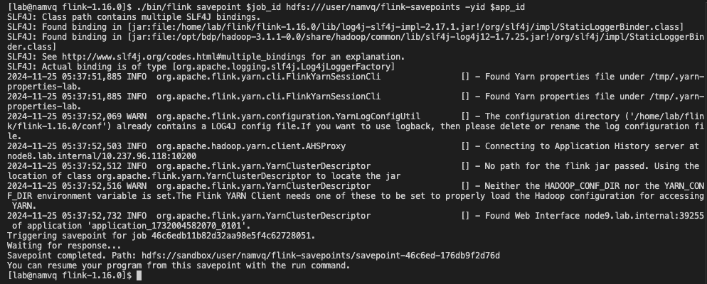

# Config in DNS
```sh
echo "search lab.internal" >> /etc/resolv.conf
echo "nameserver 10.237.96.113" >> /etc/resolv.conf
 
echo "10.237.96.113 node3.lab.internal" >> /etc/hosts
echo "10.237.96.114 node4.lab.internal" >> /etc/hosts
echo "10.237.96.115 node5.lab.internal" >> /etc/hosts
echo "10.237.96.116 node6.lab.internal" >> /etc/hosts
echo "10.237.96.117 node7.lab.internal" >> /etc/hosts
echo "10.237.96.118 node8.lab.internal" >> /etc/hosts
echo "10.237.96.119 node9.lab.internal" >> /etc/hosts
echo "10.237.96.120 node10.lab.internal" >> /etc/hosts
echo "10.237.96.121 node11.lab.internal" >> /etc/hosts

wc /etc/hadoop/conf/yarn-site.xml # validate to edit
wc /etc/hadoop/conf/mapred-site.xml # validate to edit

telnet 10.237.96.118:8032
hadoop fs -chown namvq:namvq /user/namvq
```

```sh

mkdir -p input
cp *.txt input/
hadoop jar ~/jars/hadoop-mapreduce-examples-3.3.6.jar wordcount /user/namvq/input /user/namvq/wc-output
hadoop jar ~/jars/hadoop-mapreduce-examples-3.3.6.jar wordcount /user/namvq/input /user/namvq/wc-output
hadoop fs -put empty hdfs://sandbox/user/namvq/wc-output/part-r-00000
yarn logs -applicationId application_1733048524061_0002

yarn application -list
telnet node6.lab.internal 8088
KRB5_CONFIG=krb5.conf kinit namvq

scp lab@10.237.96.80:/tmp/krb5cc_1000 /tmp/krb5cc_1000
```
yarn logs -applicationId 

# Savepoint
```sh
/bin/flink savepoint $job_id hdfs:///user/namvq/flink-savepoints -yid $app_id
```
